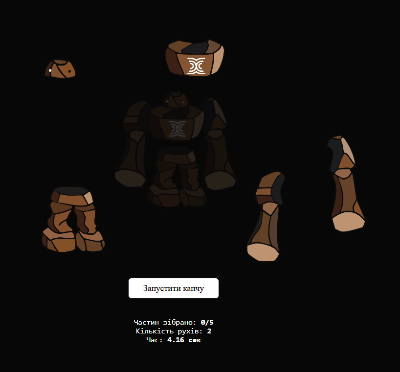

# Seasmic Robo — Кастомна CAPTCHA



## Опис

Цей проєкт — унікальна CAPTCHA, де користувач має зібрати фігуру людини з частин, які розлітаються у випадкові місця. Капча перевіряє, що ви не робот, а також показує статистику: швидкість, точність, кількість рухів.

## Особливості
- Одна фігура (людина), розбита на частини (голова, тулуб, руки, ноги)
- Частини розлітаються при запуску
- Drag-and-drop для збирання
- Підказка-силует для зручності
- Статистика: час, точність, кількість рухів
- Мінімалістичний дизайн (чорно-білий)

## Як запустити
1. Скачайте репозиторій або склонуйте:
   ```bash
   git clone https://github.com/gerberaa/seasmic-robo.git
   ```
2. Відкрийте `index.html` у браузері.

## Приклад роботи


> Натисніть "Запустити капчу", зберіть фігуру, перегляньте свою статистику!

---

**Автор:** [gerberaa](https://github.com/gerberaa)

---

_Проєкт створено для демонстрації кастомних підходів до CAPTCHA._ 